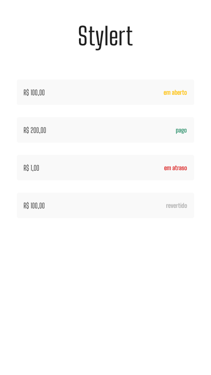

# Workshop-rockseat-stylert

<h1 align='center' >
    
</h1>

## 💻 Executando o Stylert

### Pré-requisitos

É necessário ter instalado na sua máquina para execução desse projeto:
- [Git](https://git-scm.com)
- [NodeJS](https://nodejs.org/)
- [Gerenciador de pacotes](https://www.npmjs.com)
    - [Yarn](https://classic.yarnpkg.com/en/docs/install/#windows-stable)
- [React Native](https://react-native.rocketseat.dev/)

### ⌨ Baixando o projeto

```bash
# Clone o Repositório
$ git clone https://github.com/VitorFirmino/Workshop-rockseat-stylert.git

# Acesse a pasta do projeto
$ cd Workshop-rockseat-stylert
```

### 🗄️ Iniciando o app
```bash
# Acesse a pasta
$ cd Stylert

# Instale as dependências
$ yarn

# Execute o projeto
$ yarn start
```

 learned in this workshop on Styled-components #DoWhile
